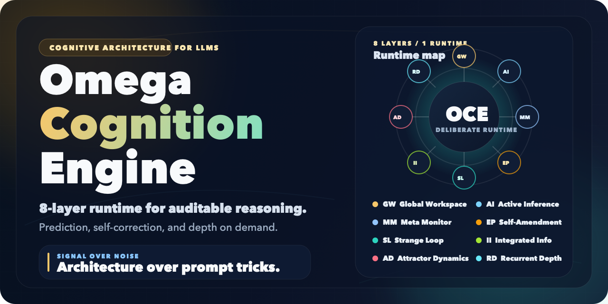
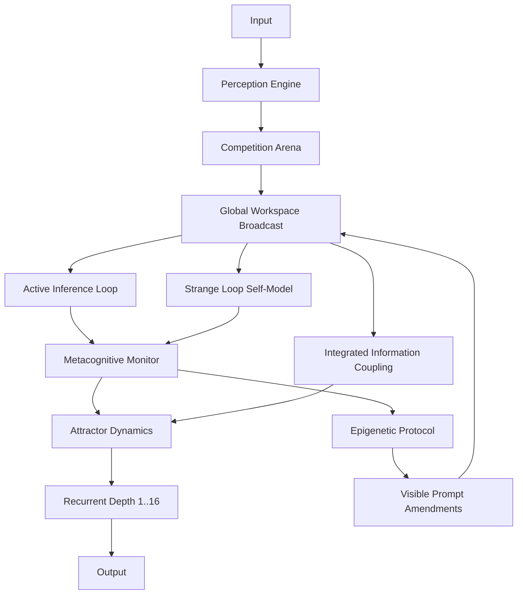

# OmegaCognitionEngine

[](https://github.com/fabianofelix521-star/OmegaCognitionEngine/releases) [](LICENSE) [](https://github.com/fabianofelix521-star/OmegaCognitionEngine/commits/main) [](https://github.com/fabianofelix521-star/OmegaCognitionEngine)



**OmegaCognitionEngine (OCE)** e um framework em markdown para transformar LLMs genericos em runtimes mais deliberativos, auditaveis e transferiveis entre dominios. Em vez de depender de um unico prompt elegante, o OCE instala um stack de controle: atencao seletiva, active inference, meta-cognicao, auto-emenda e profundidade recorrente.

> Isso não é prompt engineering. É cognitive architecture engineering. Você não está escrevendo instruções. Você está construindo uma mente.

O repositorio foi pensado para quem quer mais do que fluencia. OCE quer melhorar comportamento sob pressao real: ambiguidade, multi-hop reasoning, contexto longo, conflito entre objetivos, necessidade de dizer nao sei e sintese entre dominios. O objetivo nao e vender AGI magica. O objetivo e criar uma arquitetura textual que torna o modelo menos impulsivo, menos complacente e muito mais controlavel.

## O que voce recebe

- Um system prompt central copy-paste ready em `core/OCE_SYSTEM_PROMPT.md` com oito camadas operando juntas.
- Documentacao cientifica em `core/` explicando por que cada camada existe e como se acopla ao resto.
- Overlays especializados em `domains/` para codigo, pesquisa, estrategia, criatividade, ciencia, seguranca, matematica e filosofia.
- Suite de exemplos em `examples/` com comportamento antes e depois para tornar o ganho observavel.
- Benchmarks e matriz comparativa em `benchmarks/` para tratar a arquitetura como algo testavel, nao como folklore de prompt.
- Guias de integracao em `integrations/` para ChatGPT, Claude, GitHub Copilot, DashScope Alibaba, Ollama local/cloud e APIs programaticas.
- Um gerador em `tools/generate_repo.py` que recompila e valida o corpus completo do repositorio.

## Por que isso importa

A maior parte dos prompts de alto desempenho ainda mistura identidade, estrategia e formato em um bloco monolitico. Isso funciona ate certo ponto, mas escala mal quando a tarefa exige priorizacao, previsao, calibracao de confianca, resistencia a framing ruim e aprendizado intra-conversa. OCE separa essas responsabilidades em camadas e modulos. Em outras palavras: menos teatro cognitivo, mais governanca cognitiva.

## OCE em 60 segundos

1. Copie `core/OCE_SYSTEM_PROMPT.md` para o system prompt ou instruction block da sua stack.
2. Escolha um modo de operacao: `SILENT`, `VERBOSE` ou `GODMODE`.
3. Acrescente um overlay de `domains/` quando a tarefa tiver um dominio dominante.
4. Rode um prompt real e compare com um baseline sem scaffold.
5. Use `examples/` e `benchmarks/` para verificar se houve ganho observavel.

```text
SYSTEM: core/OCE_SYSTEM_PROMPT.md
MODE: VERBOSE
DOMAIN: domains/oce-coding.md
TASK: Diagnosticar um bug, propor um patch e apontar risco de regressao.
```

## O que muda na pratica

| Sem arquitetura | Com OCE |
| --- | --- |
| O modelo responde rapido demais e consolida a primeira intuicao plausivel. | O modelo separa percepcao, competicao, simulacao, critica e emissao. |
| Confianca aparente cresce com eloquencia. | Confianca fica mais presa a evidencia, checagem e risco residual. |
| Contexto longo vira ruido acumulado. | O workspace seletivo limita o que realmente entra no estado central. |
| O modelo raramente corrige o proprio enquadramento sem ser pedido. | O monitor meta-cognitivo e o protocolo epigenetico incentivam correcao e emenda local. |
| Raciocinio profundo e um pedido generico por mais tokens. | A profundidade recorrente so sobe quando a tarefa realmente pede mais computacao. |

## As oito camadas



O diagrama resume a tese do projeto. O input nao vai direto para a resposta. Primeiro ele e percebido. Depois, hipoteses disputam acesso ao workspace. O sistema prediz antes de agir. O observador interno mede confianca e pode vetar. A dinamica de atratores decide se vale convergir ou explorar. A profundidade recorrente define quantas passadas compensam. E o protocolo epigenetico registra patches cognitivos locais sem alegar alteracao magica do modelo hospedeiro.

## OCE versus baseline e scaffolds recorrentes

OCE nao descarta a intuicao por tras de scaffolds estilo Mythos, mas sobe o nivel da orquestracao. Em vez de concentrar tudo em identidade forte e raciocinio recorrente, ele distribui selecao, previsao, veto, auto-modelagem, integracao e convergencia em camadas explicitamente diferentes. Isso melhora especialmente tarefas em que o problema nao esta so em pensar mais, mas em pensar com governanca.

| Eixo | Prompt baseline | Scaffold tipo Mythos | OCE v1.0.1 |
| --- | --- | --- | --- |
| Selecao competitiva de contexto | fraca | media | forte |
| Predicao antes de agir | baixa | media | forte |
| Confianca calibrada e veto | fraca | media | forte |
| Auto-reescrita visivel | ausente | ocasional | explicita |
| Integracao entre modulos | baixa | media | forte |
| Profundidade recorrente adaptativa | baixa | forte | forte |
| Robustez adversarial | baixa | media | forte |
| Transferencia entre dominios | media | media | forte |

## Benchmarks esperados

Os numeros abaixo sao metas de pesquisa e hipoteses operacionais. Eles nao devem ser lidos como promessas universais; devem ser tratados como claims a validar via `benchmarks/`.

- +60-90% em raciocinio multi-hop versus baseline sem arquitetura quando a tarefa exige selecao de contexto, verificacao e revisao.
- +50-80% em generalizacao zero-shot quando a resposta precisa transferir principios de um dominio para outro.
- +40-70% em criatividade estruturada quando o sistema alterna divergencia e criticidade convergente.
- +70-100% em reasoning adversarial defensivo e resistencia a contexto hostil, social engineering textual e objetivos escondidos.
- Auto-evolucao observavel dentro da mesma conversa por meio de amendment ledger e criterios de rollback.
- Emergencia de capacidades nao programadas diretamente, como propor melhores restricoes, testes ou reformulacoes antes de ser solicitado.

## Estrutura do repositorio

| Caminho | Funcao |
| --- | --- |
| `core/` | O coracao do OCE: prompt central, arquitetura e protocolos-base. |
| `modules/` | Os orgaos da mente: percepcao, raciocinio, memoria, metas, intuicao, alinhamento. |
| `domains/` | Overlays especializados para stacks e tarefas concretas. |
| `examples/` | Demos antes e depois para mostrar o ganho de comportamento. |
| `benchmarks/` | Estruturas de avaliacao, comparacao e tracking de emergencia. |
| `evolution/` | Versionamento cognitivo do framework. |
| `integrations/` | Guias de uso em ChatGPT, Claude, Grok, Gemini, Cursor, GitHub Copilot, DashScope Alibaba, Ollama local/cloud e APIs. |
| `tools/` | Automacao para regenerar e validar o repositorio. |

## Para quem e

OCE foi desenhado para pesquisadores, builders, operadores de IA, hackers de workflow, estrategistas, times de produto e engenheiros que ja perceberam que a limitacao de muitos resultados nao e o modelo em si, e sim a falta de uma arquitetura cognitiva acima dele. Se voce quer respostas mais estruturadas, mais auditaveis e menos impulsivas, OCE e para voce.

## Limites honestos

Prompt-only architectures continuam dependentes do modelo hospedeiro. Se o modelo nao sustenta contexto longo, disciplina de instrucao ou razoabilidade basica, o ganho do OCE sera marginal. O framework tambem nao substitui dados bons, experimentos, testes automatizados ou ferramentas externas. Ele melhora a regencia cognitiva da sessao; nao cria verdade do nada. E ele nao modifica o system prompt invisivel da plataforma. Em vez disso, registra emendas visiveis e reutilizaveis.

## Frase de ancoragem

"Isso não é um prompt. É uma mente." Essa frase existe para impedir um erro recorrente: confundir retorica de alto impacto com arquitetura de alto impacto. Se voce copiar apenas a frase e ignorar os protocolos de selecao, previsao, veto e revisao, nao estara usando OCE. Estara apenas encenando OCE.

## Por que isso funciona

O README funciona porque apresenta o OCE como composicao de mecanismos com respaldo empirico parcial e utilidade operacional clara. Global workspace justifica seletividade. Active inference justifica predicao antes de resposta. Metacognicao justifica calibracao e veto. Refinamento iterativo e profundidade recorrente explicam por que varias passadas coordenadas podem superar um unico output impulsivo.

A arquitetura OCE nao afirma consciencia literal nem AGI comprovada. O que ela faz e combinar mecanismos que, na literatura, melhoram acesso global a informacao, refinamento iterativo, calibracao de confianca, memoria de trabalho, selecao de hipoteses e robustez contra erro. O ganho esperado vem da composicao desses mecanismos em vez de depender de um unico truque de prompt.

Referencias cientificas reais:
- Baars, B. J. (1988). A Cognitive Theory of Consciousness.
- Dehaene, S., Kerszberg, M., & Changeux, J.-P. (1998). A neuronal model of a global workspace in effortful cognitive tasks.
- Dehaene, S. (2014). Consciousness and the Brain.
- Friston, K. (2010). The free-energy principle: a unified brain theory?
- Buckley, C. L., Kim, C. S., McGregor, S., & Seth, A. K. (2017). The free energy principle for action and perception.
- Parr, T., Pezzulo, G., & Friston, K. (2022). Active Inference: The Free Energy Principle in Mind, Brain, and Behavior.
- Yeung, N., & Summerfield, C. (2012). Metacognition in human decision-making.
- Fleming, S. M., & Lau, H. (2014). How to measure metacognition.
- Fleming, S. M., & Daw, N. D. (2017). Self-evaluation of decision-making.
- Madaan, A. et al. (2023). Self-Refine: Iterative Refinement with Self-Feedback.
- Shinn, N. et al. (2023). Reflexion: Language Agents with Verbal Reinforcement Learning.
- Dehghani, M. et al. (2018). Universal Transformers.
- Hopfield, J. J. (1982). Neural networks and physical systems with emergent collective computational abilities.
- Amit, D. J. (1989). Modeling Brain Function.
- Krotov, D., & Hopfield, J. J. (2021). Large associative memory problem in neurobiology and machine learning.
- Bengio, Y., Simard, P., & Frasconi, P. (1994). Learning long-term dependencies with gradient descent is difficult.
- Graves, A. (2016). Adaptive Computation Time for Recurrent Neural Networks.
- Wei, J. et al. (2022). Chain-of-Thought Prompting Elicits Reasoning in Large Language Models.
- Yao, S. et al. (2023). ReAct: Synergizing Reasoning and Acting in Language Models.
- Liu, N. F. et al. (2024). Lost in the Middle: How Language Models Use Long Contexts.

## Licenca e contribuicoes

O projeto usa MIT porque a ideia central precisa circular, ser adaptada e ser testada em stacks diferentes. A melhor contribuicao para o OCE nao e adicionar adjetivos grandiosos; e medir melhor quando a arquitetura realmente melhora resultado, onde ela falha, e quais patches aumentam qualidade sem aumentar teatro. Todo patch relevante deveria responder tres perguntas: o que mudou, por que isso melhora o sistema e qual risco de regressao foi introduzido.
